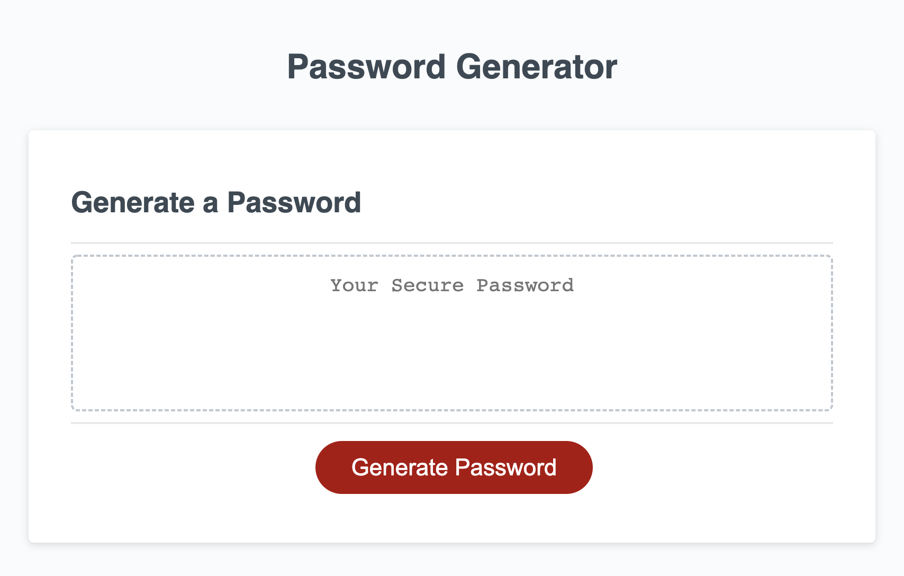

# Emilees-Password-Generator

## Description

Edited js code to enable the webpage to return a password based on prompts. Password is random, has between 8 and 128 characters, special characters, capital letters, lowercase letters, and numbers. 

## Credits

Emilee Bogdan

-[Git Hub](https://github.com/emileebogdan)

-[LinkedIn](https://www.linkedin.com/in/emileebogdan/)

